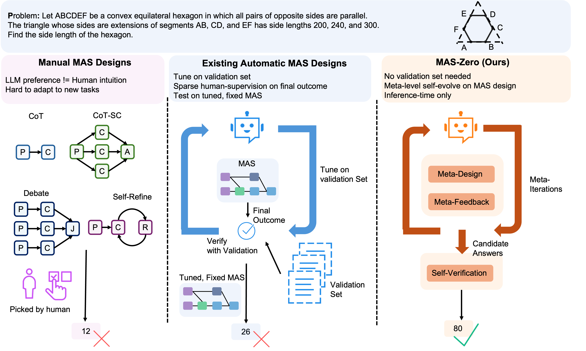
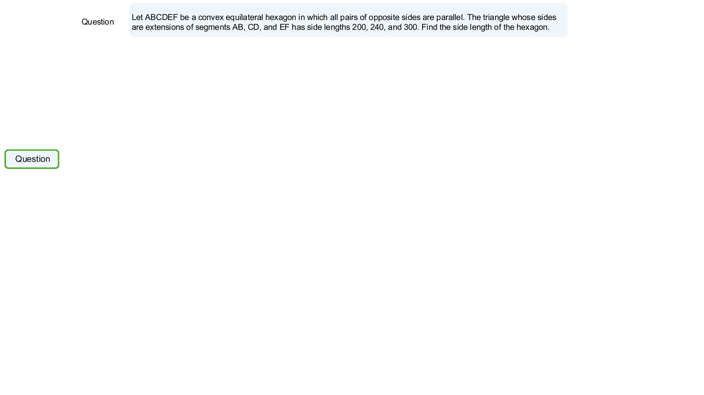

<div align="center">

<h1 align="center">
  
  Absolute Zero: Reinforced Self-play Reasoning with Zero Data
</h1>
<!-- #  Absolute Zero:  Reinforced Self-play Reasoning with Zero Data -->

[](https://arxiv.org/abs/2505.14996)    [](https://mas-design.github.io/)    [](https://github.com/SalesforceAIResearch/MAS-Zero)    [](https://mas-design.github.io/mas_collection.html)

<div align="center" style="font-family: Arial, sans-serif;">
  <p>
    <a href="#news" style="text-decoration: none; font-weight: bold;">🎉 News</a> •
    <a href="#links" style="text-decoration: none; font-weight: bold;">🔗 Links</a> •
    <a href="#todo" style="text-decoration: none; font-weight: bold;">📝 Conceptual Overview</a> •
    <a href="#algorithm-flow" style="text-decoration: none; font-weight: bold;">⚙️ Algorithm Flow</a> •
    <a href="#results" style="text-decoration: none; font-weight: bold;">📊 Results</a>
  </p>
  <p>
    <a href="#getting-started" style="text-decoration: none; font-weight: bold;">✨ Getting Started</a> •
    <a href="#training" style="text-decoration: none; font-weight: bold;">🏋️ Design MAS with Zero Supervision</a> •
    <!-- <a href="#usage" style="text-decoration: none; font-weight: bold;">🔧 Usage</a> • -->
    <!-- <a href="#evaluation-code" style="text-decoration: none; font-weight: bold;">📃 Evaluation</a> -->
  </p>
  <p>
    <a href="#citation" style="text-decoration: none; font-weight: bold;">🎈 Citation</a> •
    <a href="#acknowledgement" style="text-decoration: none; font-weight: bold;">🌻 Acknowledgement</a> •
    <a href="#contact" style="text-decoration: none; font-weight: bold;">📧 Contact</a>
    <!-- <a href="#star-history" style="text-decoration: none; font-weight: bold;">📈 Star History</a> -->
  </p>
</div>

</div>



<!-- ============================================== -->

- **[2025/05/06]** We present the **<span style="font-variant: small-caps;">MAS-Zero</span>** [[Project Page](https://mas-design.github.io/) | [Paper](https://arxiv.org/abs/2505.14996) | [Code](https://github.com/SalesforceAIResearch/MAS-Zero)]
 <!-- | [Model(s)](https://huggingface.co/collections/andrewzh/absolute-zero-reasoner-68139b2bca82afb00bc69e5b) | [Logs](https://wandb.ai/andrewzhao112/AbsoluteZeroReasoner)]. -->

<!-- ============================================== -->
<div align="left">
  <h1 id="links">🔗 Links</h1>
  <hr style="height: 3px; background: linear-gradient(90deg, #EF8E8D, #5755A3); border: none; border-radius: 3px;">
</div>

- 🏠 [[Project Page]](https://mas-design.github.io/)
- 📜 [[Paper]](https://arxiv.org/abs/2505.14996)
- 💻 [[Code]](https://github.com/SalesforceAIResearch/MAS-Zero)
<!-- - 🤗 [[Models]](https://huggingface.co/collections/andrewzh/absolute-zero-reasoner-68139b2bca82afb00bc69e5b) -->
<!-- - 📁 [[Logs]](https://wandb.ai/andrewzhao112/AbsoluteZeroReasoner) -->

<!-- ============================================== -->
<!-- <div align="left">
  <h1 id="todo">📝 Roadmap</h1>
  <hr style="height: 3px; background: linear-gradient(90deg, #EF8E8D, #5755A3); border: none; border-radius: 3px;">
</div> -->

<!-- Roadmap Item: Completed -->
<!-- <div style="margin-bottom: 0.8rem; padding: 0.8rem 1.2rem; background-color: rgba(87, 85, 163, 0.1); border-left: 5px solid #5755A3; border-radius: 8px; display: flex; align-items: center;">
  <span style="font-size: 1.2em; margin-right: 0.8rem; color: #5755A3;">✅</span>
  <span style="text-decoration: line-through; color: #AAA; font-size: 1.1em;">Release training code</span> Increased size, lighter gray for contrast -->
<!-- </div> -->

<!-- Roadmap Item: Pending -->
<!-- <div style="margin-bottom: 0.8rem; padding: 0.8rem 1.2rem; background-color: rgba(239, 142, 141, 0.2); border-left: 5px solid #EF8E8D; border-radius: 8px; display: flex; align-items: center;">
  <span style="font-size: 1.2em; margin-right: 0.8rem; color: #EF8E8D;">⏳</span>
  <span style="color: #FFF; font-size: 1.1em; font-weight: 500;">Release evaluation code</span> Increased size, color #FFF, slight bold -->
<!-- </div> -->

<!-- Roadmap Item: Pending -->
<!-- <div style="margin-bottom: 0.8rem; padding: 0.8rem 1.2rem; background-color: rgba(239, 142, 141, 0.2); border-left: 5px solid #EF8E8D; border-radius: 8px; display: flex; align-items: center;">
  <span style="font-size: 1.2em; margin-right: 0.8rem; color: #EF8E8D;">⏳</span>
  <span style="color: #FFF; font-size: 1.1em; font-weight: 500;">Update veRL</span> Increased size, color #FFF, slight bold -->
<!-- </div> -->

<!-- Roadmap Item: Pending -->
<!-- <div style="margin-bottom: 0.8rem; padding: 0.8rem 1.2rem; background-color: rgba(239, 142, 141, 0.2); border-left: 5px solid #EF8E8D; border-radius: 8px; display: flex; align-items: center;">
  <span style="font-size: 1.2em; margin-right: 0.8rem; color: #EF8E8D;">⏳</span>
  <span style="color: #FFF; font-size: 1.1em; font-weight: 500;">Upgrade Python executor</span> Increased size, color #FFF, slight bold -->
<!-- </div> -->

<!-- ============================================== -->
<div align="left">
  <h1 id="algorithm-flow">⚙️ Algorithm Flow</h1>
  <hr style="height: 3px; background: linear-gradient(90deg, #EF8E8D, #5755A3); border: none; border-radius: 3px;">
</div>

<p>
  We propose <span style="font-variant: small-caps;">MAS-Zero</span>, a <strong>meta-agent</strong> that serves several roles (design, evaluate, and verify) and involves two steps:
</p>
<ol>
  <li>
    <strong>Meta-Iterations:</strong>
    <ol style="margin-top: 0;" type="a">
      <li><strong>MAS-Design:</strong> Task Decomposition and propose sub-MAS for each sub-task. We frame the MAS design as code generation.</li>
      <li><strong>MAS-Feedback:</strong> Evaluate the generated MAS design on solvability and completeness. We evalaute these metrics using intermediate outputs by executing the MAS code.
      </li>
    </ol>
  </li>
  <li>
    <strong>Self-Verification:</strong>
    selects the most suitable outcome from the set of all candidate solutions generated throughout the meta-iteration process.
  </li>
</ol>

<p>
  <strong>In the whole process:</strong> no validation set needed; Meta-level self-supervision on MAS design; Inference-time only.
</p>



<!-- ============================================== -->
<div align="left">
  <h1 id="results">📊 Results</h1>
  <hr style="height: 3px; background: linear-gradient(90deg, #EF8E8D, #5755A3); border: none; border-radius: 3px;">
</div>

## Performance vs. Cost
**MAS-Zero** sets a new frontier in the performance-cost trade-off across diverse domains and LLMs.


## All Results

Our approach achieves strong performance across mathematical reasoning, graduate-level QA, and code benchmarks, using GPT-4o, LLaMA3.3-70B, and Qwen2.5-32B, without relying on any external supervision.


<!-- ============================================== -->
<div align="left">
  <h1 id="getting-started">✨ Getting Started</h1>
  <hr style="height: 3px; background: linear-gradient(90deg, #EF8E8D, #5755A3); border: none; border-radius: 3px;">
</div>

## 🎄 Environment Setup
```bash
conda create -n mas_zero python=3.12 && conda activate mas_zero
pip install anthropic
pip install openai
pip install backoff
pip install together
cd ./
pip install -r requirements.txt
pip install datasets
pip install jinja2
pip install -e human-eval
```

<!-- ## 💾 Data Processing
### Process evaluation data on CruxEval / LiveCodeBench Execution during AZR Self-play
```bash
python -m absolute_zero_reasoner.data_construction.process_code_reasoning_data
``` -->

<!-- ============================================== -->
<div align="left">
  <h1 id="training">🏋️ Design MAS with Zero Supervision</h1>
  <hr style="height: 3px; background: linear-gradient(90deg, #EF8E8D, #5755A3); border: none; border-radius: 3px;">
</div>

> **⚠️WARNING⚠️**: The implementation in this repository is very raw and intended for research purposes only. It is not secure for production environments. We plan to update our code to more secure implementations in the future. Your use of our code is at your own discretion and risk.


<!-- ## 🫛 Seeding (Optional)
We provide the seed datasets we collected by prompting each model in data/. If you want to create your own seed data, use the following script:
```bash
export OUTPUT_SEED_PATH=data/<new_ded_abd_seed_data_name>.jsonl
export OUTPUT_CODE_F_SEED_PATH=data/<new_ind_seed_data_name>.jsonl
bash scripts/seeding/<7b|14b|coder3b|coder7b|coder14b|llama>.sh
``` -->

## ♟️ Search
<!-- 3b models need 2 X 80gb GPUs, 7/8b models need 4 X 80gb, 14b requires 8 X 80gb
```bash
bash scripts/selfplay/<7b|14b|coder3b|coder7b|coder14b|llama>.sh
``` -->
You can change AIME (`aime24`) to GPQA (`gpqa_diamond`) or SWE-Bench (`swe_bench`). For SWE-Bench, you need to follow the [SWE-Bench](https://github.com/SWE-bench/SWE-bench) instructions to install the Docker environment first. You can also modify `meta_model` and `node_model` to other LLMs. Please refer to the `sampler/` folder (we support GPT, Claude, VLLM, and TogetherAI).

```bash
export OPENAI_API_KEY={YourKey}
export TOGETHER_API_KEY={YourKey}

python main_question.py  --dataset workflow_search/aime24 --option plan --meta_model gpt-4o_chatgpt --node_model gpt-4o_chatgpt --verifier_model gpt-4o_chatgpt --blocks COT COT_SC Reflexion LLM_debate --use_oracle_verifier --defer_verifier --n_generation 5 

```

## 🔍 Verification

Similarly, you can change AIME (`aime24`) to GPQA (`gpqa_diamond`) or SWE-Bench (`swe_bench`). You can also modify `model` to other LLMs. Please refer to the `sampler/` folder (we support GPT, Claude, VLLM, and TogetherAI).

```bash
export OPENAI_API_KEY={YourKey}
export TOGETHER_API_KEY={YourKey}

python main_judge.py  --dataset aime24 --judge_method self --baseline workflow_search --model gpt-4o_chatgpt --min_sample 0 --max_sample 30 --max_response_per_sample 5 

```


<!-- ## 🌚 Resuming Runs
When resuming runs, put the original run wandb id into the script, i.e., `trainer.wandb_run_id=<run_id>`. -->

<!-- ## 🤗 Converting veRL checkpoints to HF format
```bash
python -m absolute_zero_reasoner.utils.convert2hf \
  <veRL_ckpt_path>/actor \
  <veRL_ckpt_path>/actor/huggingface/ \
  <hf_ckpt_path>
``` -->

<!-- ## 📈Design Your Own Intrinsic Rewards!
In configs, just add your own rewards to `azr.reward.generation_reward_config`, check the ones already implemented such as diversity and complexity rewards. Be Creative! -->

<!-- ============================================== -->
<!-- <div align="left">
  <h1 id="usage">🔧 Usage</h1>
  <hr style="height: 3px; background: linear-gradient(90deg, #EF8E8D, #5755A3); border: none; border-radius: 3px;">
</div>

We use the Deepseek R1 <think> & <answer> tags as prompt template:

```
A conversation between User and Assistant. The user asks a question, and the Assistant solves it. The assistant first thinks about the reasoning process in the mind and then provides the user with the answer. The reasoning process and answer are enclosed within <think> </think> and <answer> </answer> tags, respectively, i.e., <think> reasoning process here </think> <answer> answer here </answer>. User: {question}\nAssistant: <think>
``` -->

<!-- ============================================== -->
<!-- <div align="left">
  <h1 id="evaluation-code">📃 Evaluation Code</h1>
  <hr style="height: 3px; background: linear-gradient(90deg, #EF8E8D, #5755A3); border: none; border-radius: 3px;">
</div>

TODO -->

<!-- ============================================== -->
<div align="left">
  <h1 id="citation">🎈 Citation</h1>
  <hr style="height: 3px; background: linear-gradient(90deg, #EF8E8D, #5755A3); border: none; border-radius: 3px;">
</div>

If you find Absolute Zero Reasoner helpful, please cite us.

```bibtex
@misc{ke2025maszero,
      title={MAS-Zero: Designing Multi-Agent Systems with Zero Supervision}, 
      author={Zixuan Ke and Austin Xu and Yifei Ming and Xuan-Phi Nguyen and Caiming Xiong and Shafiq Joty},
      year={2025},
      eprint={2505.14996},
      archivePrefix={arXiv},
      primaryClass={cs.CL},
      url={https://arxiv.org/abs/2505.14996}, 
}
```

<!-- ============================================== -->
<div align="left">
  <h1 id="acknowledgement">🌻 Acknowledgement</h1>
  <hr style="height: 3px; background: linear-gradient(90deg, #EF8E8D, #5755A3); border: none; border-radius: 3px;">
</div>
<!-- This project received help from many researchers at Salesforce AI Research. The code is adapted from the [ADAS](https://github.com/ShengranHu/ADAS). During development, we also referred to [simple-evals](https://github.com/openai/simple-evals), [MaAS](https://github.com/bingreeky/MaAS), and [AFlow](https://github.com/FoundationAgents/AFlow).   -->

This project received help from many researchers at Salesforce AI Research. The code is adapted from the [ADAS](https://github.com/ShengranHu/ADAS). During development, we also referred to [simple-evals](https://github.com/openai/simple-evals), [MaAS](https://github.com/bingreeky/MaAS), and [AFlow](https://github.com/FoundationAgents/AFlow).  

Many thanks to the authors of these projects for their excellent contributions!

<!-- ============================================== -->
<div align="left">
  <h1 id="contact">📧 Contact</h1>
  <hr style="height: 3px; background: linear-gradient(90deg, #EF8E8D, #5755A3); border: none; border-radius: 3px;">
</div>

Feel free to contact Zixuan Ke via email: zixuan.ke@salesforce.com

<!-- ============================================== -->
<!-- <div align="left">
  <h1 id="star-history">📈 Star History</h1>
  <hr style="height: 3px; background: linear-gradient(90deg, #EF8E8D, #5755A3); border: none; border-radius: 3px;">
</div> -->

<!-- [](https://www.star-history.com/#LeapLabTHU/Absolute-Zero-Reasoner&Date) -->